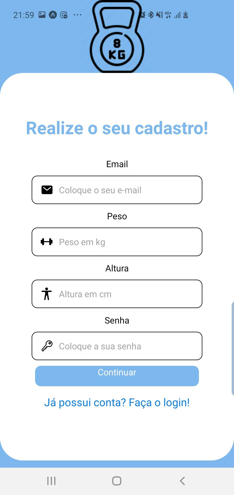
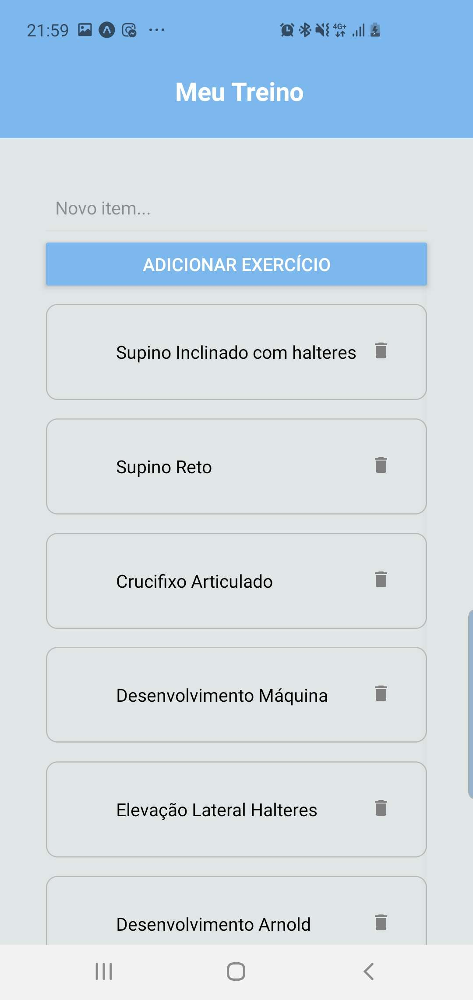
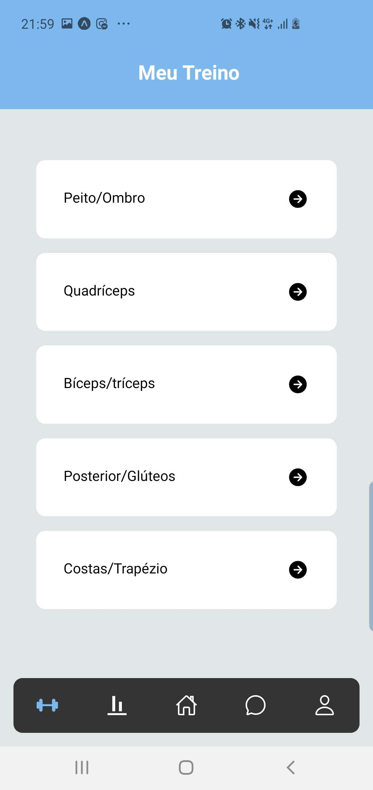

# Projeto - Aplicativo de musculação 0.2


Um aplicativo de musculação que oferecerá rotinas de exercícios, planos de treinamento e rastreamento de progresso para ajudar os usuários.

## Importante ##
o O service está no "Gym-app-0.2"

## Índice
- <a href="#funcionalidades">Funcionalidades do Projeto</a>
  - <a href="#layout">Layout</a>
  - <a href="#rodar">Como rodar este projeto?</a>
  - <a href="#tecnologias">Tecnologias Utilizadas</a>
  - <a href="#autor">Autor</a>
  - <a href="#passos">Próximos Passos</a>

## 📱Funcionalidades do Projeto
  
  - [x] Login
  - [x] Cadastro
  - [x] NavBar
  - [x] Editar exercícios

 ## 🖥️Layout
   
   
   
   
   
   
##  Como rodar este projeto?
  ```bash
  # Clone este repositório
  $ git clone linkrepo
  
  # Acesse a pasta no seu terminal
  $ cd (caminho)/gym-app
  
  # Instale as dependências
  $ npm install
  
  # Execute o aplicativo
  $ yarn start
  ```
  
## Tecnologias Utilizadas
  1. [React](https://reactnative.dev)
  2. [Yarn](https://classic.yarnpkg.com/en/docs/cli/run)
  3. [Node](https://nodejs.org/en)
  4. [Expo](https://docs.expo.dev/get-started/installation/)
  5. [Docker](https://www.docker.com)

## Autor
 - George José Cesar da Silva (01430653)
 - Israel Allan Vilela Viegas (01433868)
 - Marcos Antônio Ferreira Guimarães (01405752)
 
## Próximos passos
 
 - [ ] Editar Treinos
 - [ ] Perfil
